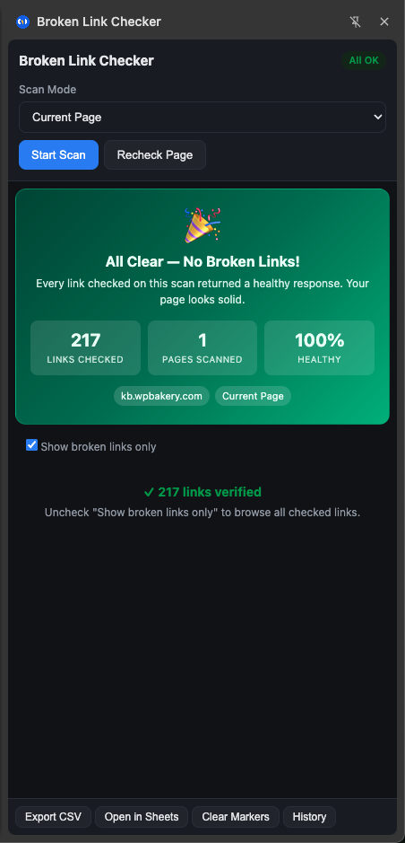
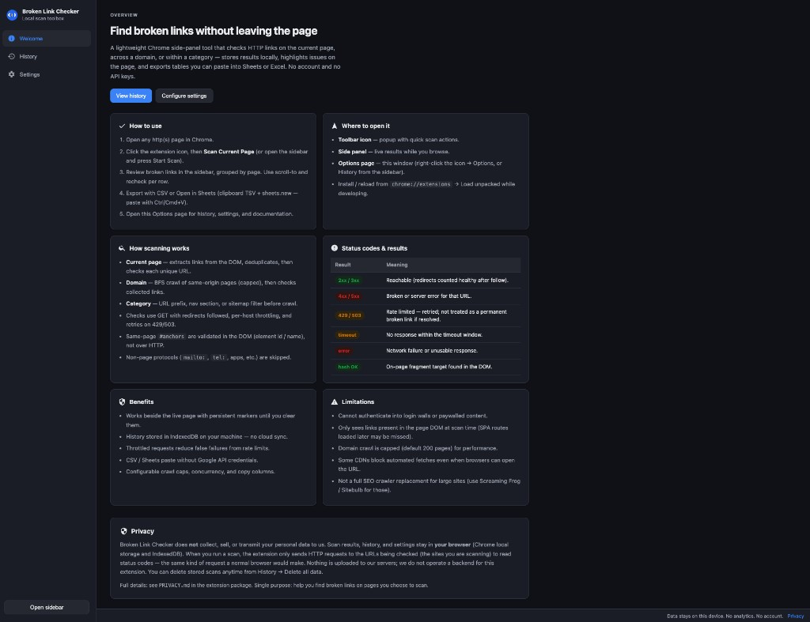
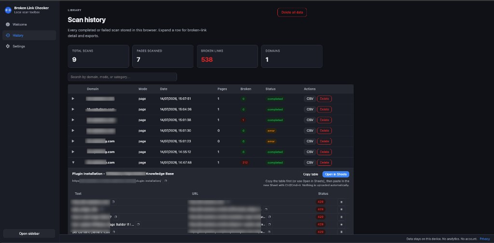
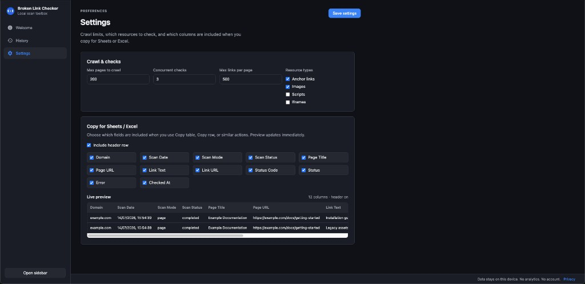

<p align="center">
  
</p>

<h1 align="center">Broken Link Checker</h1>

<p align="center">
  <strong>Local scan toolbox for Chrome</strong> — find broken links without leaving the page.<br />
  No account · No API keys · Data stays on this device
</p>

<p align="center">
  <a href="https://gtarafdar.github.io/broken-link-checker/"></a>
  <a href="LICENSE"></a>
  <a href="PRIVACY.md"></a>
  <a href="https://github.com/Gtarafdar/broken-link-checker/releases"></a>
  <a href="https://github.com/sponsors/Gtarafdar"></a>
  <a href="https://github.com/Gtarafdar/broken-link-checker/stargazers"></a>
</p>

<p align="center">
  <a href="https://gtarafdar.github.io/broken-link-checker/">Website</a> ·
  <a href="https://gtarafdar.github.io/broken-link-checker/#download">Download package</a> ·
  <a href="#how-to-install">Install</a> ·
  <a href="#how-to-use">How to use</a> ·
  <a href="PRIVACY.md">Privacy</a> ·
  <a href="https://github.com/sponsors/Gtarafdar">Donate</a> ·
  <a href="https://x.com/gtarafdarr">X</a>
</p>

---

## Why this exists

Most link checkers want an account, a crawl budget, or a cloud upload. Broken Link Checker is a **Chrome side-panel toolbox**: scan the page (or a bounded same-origin crawl), highlight problems in place, keep history in IndexedDB, and export tables for Sheets/Excel — all on your machine.

**Website:** [gtarafdar.github.io/broken-link-checker](https://gtarafdar.github.io/broken-link-checker/)

## Screenshots

<p align="center">
  
</p>

| Welcome | History | Settings |
| :---: | :---: | :---: |
|  |  |  |

## Features

- **Scan modes** — Current page, domain BFS crawl, or category-scoped (prefix / nav / sitemap)
- **Side panel** — Live results grouped by page, progress, recheck, markers
- **Page highlighting** — Broken links outlined on the page (persist until you clear)
- **History library** — Searchable scans with expand-for-detail, CSV, copy-for-Sheets
- **Export** — CSV download or clipboard TSV for Google Sheets / Excel (no Google API)
- **Settings** — Crawl limits, concurrency, resource types, export column picker + live preview
- **Privacy-first** — No analytics, no cloud backend; see [PRIVACY.md](PRIVACY.md)

## Download

| Package | Size | Notes |
| --- | --- | --- |
| [broken-link-checker-v1.0.0.zip](https://gtarafdar.github.io/broken-link-checker/download/broken-link-checker-v1.0.0.zip) | ≈ 56 KB | Unzip → Load unpacked in Chrome |
| [GitHub Releases](https://github.com/Gtarafdar/broken-link-checker/releases) | — | Preferred once a release is published |

Or clone this repo and load the project root (the folder that contains `manifest.json`).

## How to install

1. Download and **unzip** the package (keep the folder — Chrome loads from that path).
2. Open `chrome://extensions` and enable **Developer mode**.
3. Click **Load unpacked** → select the folder that contains `manifest.json`.
4. Pin the extension, open any `http(s)` page, and use the popup / **Open sidebar**.

First install opens the **Welcome** tab in Options with the full overview.

## How to use

1. Open a page you care about.
2. Click the extension icon → scan current page, domain, or category.
3. Review links in the **side panel**; broken targets are marked on the page.
4. Export from the sidebar or **Options → History** (CSV / Copy table / Open in Sheets).
5. Tune limits under **Options → Settings**.

### Google Sheets

1. Expand a scan → **Copy table** (or **Open in Sheets** for a blank sheet).
2. Paste with **Cmd/Ctrl+V**. Nothing is uploaded automatically.

### Clear markers

Use **Clear Markers** in the sidebar or popup when you are done.

## Status legend

| Result | Meaning |
| --- | --- |
| `2xx` / `3xx` | Reachable |
| `4xx` / `5xx` | Broken / server error |
| `429` / `503` | Rate limited (not the same as dead) |
| `timeout` | No response in time |
| `error` | Network failure |
| `hash OK` | On-page fragment target found |

## Privacy

**We do not collect personal information.** Scan history and settings stay in this browser. Network requests go only to the sites you choose to check. Full policy: [PRIVACY.md](PRIVACY.md).

## License

[MIT](LICENSE) © 2026 [Gobinda Tarafdar](https://github.com/Gtarafdar/)

## Support

If this saves you a crawl morning:

- ⭐ [Star the repo](https://github.com/Gtarafdar/broken-link-checker)
- 💗 [Sponsor / donate](https://github.com/sponsors/Gtarafdar)
- 🐦 [X @gtarafdarr](https://x.com/gtarafdarr)
- ✉️ [gobinda.ext1@gmail.com](mailto:gobinda.ext1@gmail.com)

## About the maker

**Gobinda Tarafdar** — WordPress product marketer · stubborn problem-solver · lifelong Harry Potter devotee.

Product Marketing Specialist at [WPBakery](https://wpbakery.com/). More local tools: [Slack Agent Bridge](https://gtarafdar.github.io/slack-agent-bridge/), and other repos on [github.com/Gtarafdar](https://github.com/Gtarafdar/).

## Project structure

```
manifest.json          Extension config (MV3)
background/            Service worker (scan orchestration)
content/               Highlighter + link extractor
sidebar/               Side panel UI
options/               Welcome · History · Settings
popup/                 Quick actions
lib/                   Checker, crawler, storage, export, copy
docs/                  GitHub Pages landing site
dist/                  Packaged ZIP builds
PRIVACY.md             Privacy policy
STORE.md               Chrome Web Store notes
LICENSE                MIT
```

## Chrome Web Store

See [STORE.md](STORE.md) for the publish checklist. Until listing is live, use the ZIP + Load unpacked flow above.
